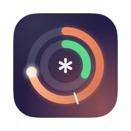
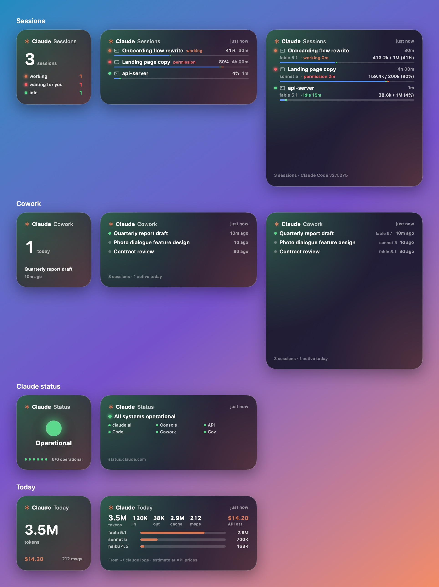
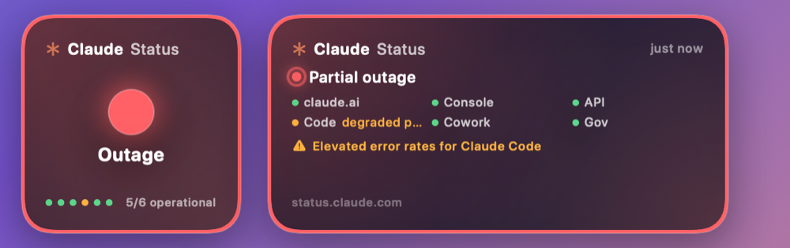

<p align="center">
  
</p>

<h1 align="center">Orbit for Claude Code</h1>

<p align="center">
  A macOS menu bar app and a set of desktop widgets for <b>Claude Code</b>: usage limits with a pace marker, live session activity, context windows, Cowork sessions, Claude service status and today's local token volume.<br>
  macOS 26+ · Liquid Glass · English / 日本語 / 简体中文 / 한국어 · MIT
</p>


> **Unofficial.** Not affiliated with Anthropic. Orbit reads the OAuth token Claude Code stores in your keychain and calls the same undocumented endpoints Claude Code uses for `/usage`; those can change without notice.

## Widgets

Five widgets in one app. Place the ones you need side by side; they share one design setting so they look like a set.

| Widget | Sizes | Shows | Tap |
|---|---|---|---|
| **Usage** | S / M / L | 5-hour and weekly limits, per-model weekly caps (Fable / Opus / Sonnet), pace marker, weekly usage by surface, status, sessions, today | claude.ai usage page |
| **Sessions** | S / M / L | Running Claude Code sessions with a live activity lamp, title or folder, where it was started, uptime, and each session's context window (used / limit, cached vs fresh) | Opens that session in the Claude desktop app, or the folder in Finder for terminal sessions |
| **Cowork** | S / M / L | Recent Cowork sessions from the desktop app: title, last activity, model | Claude app |
| **Claude status** | S / M | status.claude.com: overall state, every component, open incidents. Incidents get a warning halo | status.claude.com |
| **Today** | S / M | Tokens (in / out / cache), messages, API-equivalent cost, breakdown by model, cache hit rate | Refresh now |



### Reading the widgets

- **Pace marker** — the white tick on a bar or ring is the elapsed fraction of the window. Usage 10 points above it is *above target* (orange), 25 points above is *well above target* (red). Anthropic's own `severity` flag can raise the level but never lower it.
- **Activity lamps** — orange: working · red: waiting for you (permission prompt or input) · green: idle · grey: unknown. Same source as the desktop app's indicator (`~/.claude/sessions`), polled every 20 seconds; widgets reload only when something changed.
- **Context window** — "566.4k / 1M (57%)" is the last turn's `input + cache_read` over the model's limit (200k or 1M), exactly what the desktop app shows. The bar splits cached prompt (blue), cache writes (green) and fresh input (orange).
- **Entry icon** before a session name: terminal, desktop app window, `</>` for IDE extensions, box for the Agent SDK, two people for Cowork, cloud for remote.

### Menu bar

The menu bar item shows the worst window (`✱ 45%`, plus ⚠︎ during a Claude incident). Its menu is minimal: design switch, refresh (⌘R), settings (⌘,) and quit; everything else lives in the widgets.

### Designs

**Glass Orbit** (default) — concentric rings, inner 5-hour, outer the most constraining weekly cap; both numbers inside. **Pace Bars** — capsule bars with pace markers. **Console** — monospace, `❯ claude /usage`. All three adapt to the tinted / clear widget styles of macOS 26.

Bars, rings and numbers animate between timeline updates.

### During an incident

When status.claude.com reports a problem, the status widget gets a warning halo, the affected component is called out, the menu bar lamp pulses and the menu bar item shows ⚠︎:



## Requirements

- macOS 26 or later (Xcode 27 to build)
- A Claude **Pro or Max** subscription, logged in through the Claude Code CLI (`claude`)

## Install

```bash
brew tap akito8639/tap
brew trust akito8639/tap          # third-party taps must be trusted once
brew install --cask orbit-for-claude-code
```

Or download the latest `Orbit-for-Claude-Code-<version>.zip` from the [Releases page](https://github.com/akito8639/orbit-for-claude-code/releases/latest), unzip it and move the app to `/Applications`. The app is signed with a Developer ID and notarized, so it opens without Gatekeeper warnings.

1. Launch Orbit. It lives in the menu bar as `✱ 45%` and opens Settings on first run.
2. If it says *token expired*, run `claude` once in a terminal and `/login`. If `ANTHROPIC_API_KEY` is set in your shell, run `env -u ANTHROPIC_API_KEY claude` instead, otherwise the CLI uses the API key and never refreshes the OAuth token.
3. Right-click the desktop → **Edit Widgets** → search *Orbit* → add any of the five widgets.
4. Menu bar ✱ → gear opens Settings: every piece of information has a switch, plus the three designs, refresh interval, session titles vs folder names, and an English-only option for widgets.

Only the OAuth token Claude Code stores at login works. `claude setup-token` tokens lack the `user:profile` scope (403) and API keys (`sk-ant-api…`) cannot read plan limits. Access tokens expire after about eight hours; by default Orbit refreshes them with the refresh token and writes the result back to the same keychain item Claude Code uses.

## Data sources

| Item | Source |
|---|---|
| 5-hour / weekly utilization, reset times, per-model caps, severity | `api.anthropic.com/api/oauth/usage` (`limits` array) |
| Weekly usage by surface, extra usage credits | same (`seven_day_breakdown`, `extra_usage`) |
| Account e-mail, plan badge (MAX 20x) | `/api/oauth/profile` + keychain item |
| Service status, components, incidents | `status.claude.com/api/v2/summary.json` |
| Running sessions, activity, title, entrypoint | `~/.claude/sessions/*.json` (pid liveness checked) |
| Context window per session | tail of `~/.claude/projects/<cwd>/<session>.jsonl` |
| Cowork sessions | `~/Library/Application Support/Claude/local-agent-mode-sessions` |
| Today's tokens and cost | `~/.claude/projects/**/*.jsonl` modified today, deduplicated by message id |

The token is sent only to `api.anthropic.com`. No telemetry. Local logs are aggregated on your Mac and never leave it. Details in [docs/PRIVACY.md](docs/PRIVACY.md); release process in [docs/DISTRIBUTION.md](docs/DISTRIBUTION.md).

## Build from source

```bash
git clone https://github.com/akito8639/orbit-for-claude-code.git
cd orbit-for-claude-code
cp Config.xcconfig Config.local.xcconfig   # set DEVELOPMENT_TEAM to your Team ID
open Orbit.xcodeproj                        # ⌘R
```

`Config.local.xcconfig` is git-ignored and overrides `Config.xcconfig` (Team ID, App Group, bundle id prefix). The App Group must be `<TeamID>.<something>`; the code reads it from the signed entitlements at runtime.

```
Shared/   models, settings, the three designs, secondary widget views, Localizable.xcstrings (app + widget)
App/      menu bar app: collector (keychain / API / status / ~/.claude), settings, URL routing, gallery renderer, AppIcon.icon
Widget/   WidgetKit bundle (Usage, Sessions, Cowork, Claude status, Today)
homebrew/ Cask template for your tap
.github/  CI build; tag-triggered signed + notarized release
docs/     design proposal, renders, distribution notes
```

Render flags for previews: `--render out.png [--live]`, `--render-extras out.png [--live] [--incident]`, `--render-panel out.png`, `--render-settings out.png`, `--render-icon out.png`, `--render-icon-bundle App/AppIcon.icon`, plus `--style glassOrbit|paceBars|console`. Diagnostics: `--fetch [--refresh-token]`, `--raw`, `--sessions`, `--sizes`, `--reload`.

If the widget gallery does not pick up a new build, `killall chronod NotificationCenter` refreshes it.

## License

MIT — see [LICENSE](LICENSE).

---

## 日本語

Claude Code の使用量（5 時間枠 / 週間枠 / Fable などモデル別の週間枠）をペース目印付きで表示する、macOS のメニューバーアプリ＋ウィジェット集です。

- **ウィジェットは 5 種類**: Usage（使用量）、Sessions（起動中セッション。処理中 / 入力待ち / 待機のランプ、コンテキストウィンドウ）、Cowork（デスクトップ版の Cowork セッション）、Claude status（稼働状況。障害時は赤いハロー）、Today（今日のトークン量と API 換算コスト）
- **タップ**: Usage → claude.ai の使用量ページ、Sessions の行 → そのセッションをデスクトップ版で開く、Status → status.claude.com、Today → 即時更新
- **デザイン**: Glass Orbit / Pace Bars / Console。macOS 26 の着色・クリア表示に対応。更新時はバーや数字がアニメーション
- **動作要件**: macOS 26 以降、Claude Pro / Max、Claude Code CLI でログイン済み
- **インストール**: `brew tap akito8639/tap && brew trust akito8639/tap && brew install --cask orbit-for-claude-code`、または [Releases ページ](https://github.com/akito8639/orbit-for-claude-code/releases/latest)の zip を展開して「アプリケーション」フォルダへ
- 「token expired」が出たら、ターミナルで `claude` を一度起動して `/login`（`ANTHROPIC_API_KEY` を設定している場合は `env -u ANTHROPIC_API_KEY claude`）。`claude setup-token` のトークンと API キーは使えません
- 表示項目は設定ですべて ON / OFF。UI はシステム言語に追従（英語 / 日本語 / 簡体字中国語 / 韓国語）。ウィジェットだけ英語に固定する設定あり
- 非公式プロジェクトで、Anthropic とは無関係です
