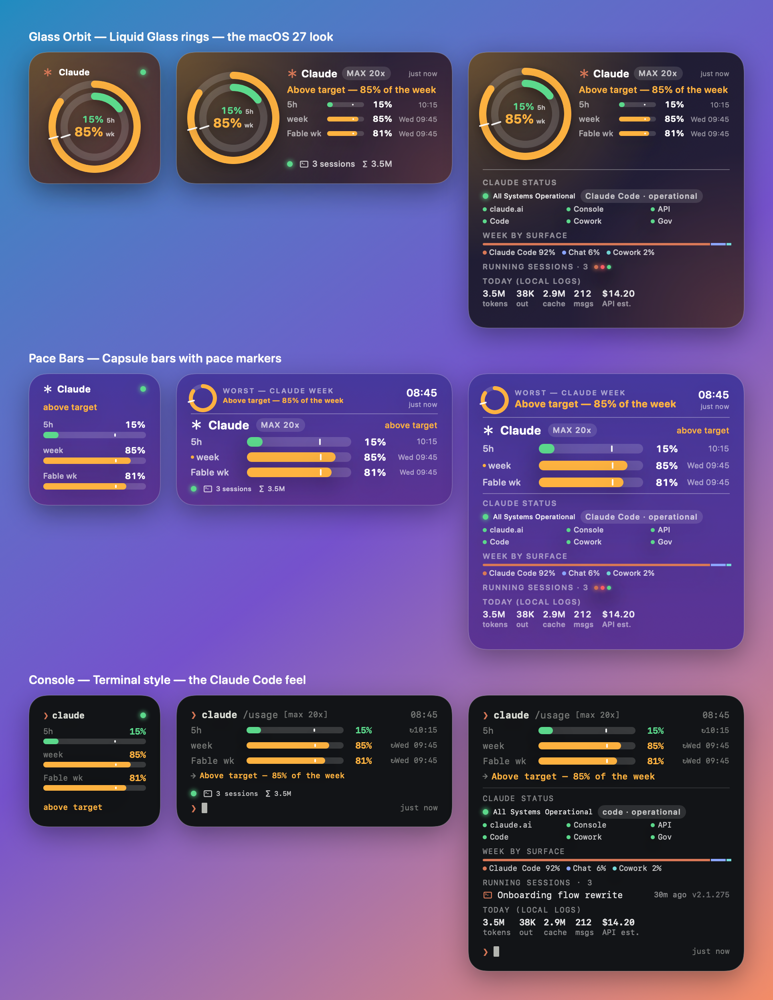

# Orbit for Claude Code

A macOS menu bar app and WidgetKit widget for **Claude Code** usage: the 5-hour and weekly limits, per-model weekly caps (e.g. Fable), a pace marker that shows whether you are burning through the window faster than linear, Claude service status, running Claude Code sessions and today's token volume from local logs. Three looks (Liquid Glass rings, pace bars, console), Small / Medium / Large widgets.



Four widgets in one app, so you can place the ones you need side by side: **Usage** (limits and pace), **Sessions** (running Claude Code sessions), **Claude status** (status.claude.com by component) and **Today** (local tokens and cost by model).


> **Unofficial.** Not affiliated with Anthropic. It reads Claude Code's own OAuth token from your keychain and calls the same undocumented endpoints Claude Code uses for `/usage`; those can change without notice.

## Requirements

- macOS 26 or later (Xcode 27 to build)
- A Claude **Pro or Max** subscription, logged in through the Claude Code CLI (`claude`)

## Install

```bash
brew tap akito8639/tap
brew install --cask orbit-for-claude-code
```

Or download `Orbit-for-Claude-Code-<version>.zip` from Releases, unzip and move the app to `/Applications`.

1. Launch Orbit. It lives in the menu bar as `✱ 45%`.
2. If it says *token expired*, run `claude` once in a terminal and `/login`. If `ANTHROPIC_API_KEY` is set in your shell, run `env -u ANTHROPIC_API_KEY claude` instead, otherwise the CLI uses the API key and never refreshes the OAuth token.
3. Right-click the desktop → **Edit Widgets** → search *Orbit* → add any of the four widgets in Small, Medium or Large.
4. Menu bar ✱ → gear opens Settings: toggles for every piece of information, the three designs, refresh interval. The UI follows the system language (English, 日本語, 简体中文, 한국어); a toggle keeps the widgets in English regardless.

Only the OAuth token Claude Code stores at login works. `claude setup-token` tokens lack the `user:profile` scope (403) and API keys (`sk-ant-api…`) cannot read plan limits.

## What it shows (each switchable in Settings)

| Item | Source |
|---|---|
| 5-hour and weekly utilization, reset times, pace marker | `api.anthropic.com/api/oauth/usage` (`limits` array) |
| Per-model weekly caps (Fable / Opus / Sonnet), API severity | same, `weekly_scoped` limits |
| Weekly usage by surface (Claude Code / chat / Cowork) | same, `seven_day_breakdown` |
| Extra usage credits | same, `extra_usage` |
| Account e-mail, plan badge (MAX 20x) | `/api/oauth/profile` + keychain item |
| Service status, Claude Code component, incidents, per-component dots | `status.claude.com/api/v2/summary.json` |
| Running Claude Code sessions: live activity lamp (working / input needed / permission / idle, same source as the desktop app), title or folder name, uptime, version, and each session's context window (used / limit, cached vs fresh) | `~/.claude/sessions/*.json` (pid liveness checked) + the tail of each session's transcript in `~/.claude/projects` |
| Today's tokens (input / output / cache) and API-equivalent cost | `~/.claude/projects/**/*.jsonl` modified today, deduplicated by message id |

Tapping a widget: **Usage** opens the usage page on claude.ai, **Sessions** rows open that session in the Claude desktop app (`claude://code/continue?session=…`) or, for terminal sessions, the project folder in Finder, **Claude status** opens status.claude.com, **Today** refreshes immediately.

The pace marker is the elapsed fraction of the window. Usage 10 points above it is *above target* (orange), 25 points above is *well above target* (red).

## Build from source

```bash
git clone https://github.com/akito8639/orbit-for-claude-code.git
cd orbit-for-claude-code
cp Config.xcconfig Config.local.xcconfig   # then set DEVELOPMENT_TEAM to your Team ID
open Orbit.xcodeproj                  # ⌘R
```

`Config.local.xcconfig` is git-ignored and overrides `Config.xcconfig` (Team ID, App Group, bundle id prefix). The App Group must be `<TeamID>.<something>`; the code reads it from the signed entitlements at runtime.

Command line:

```bash
xcodebuild -project Orbit.xcodeproj -scheme Orbit -configuration Release -derivedDataPath build build
open "build/Build/Products/Release/Orbit for Claude Code.app"
```

### Layout

```
Shared/   models, settings keys, the three designs, Localizable.xcstrings (en / ja / zh-Hans / ko) — used by app and widget
App/      menu bar app: collector (keychain / API / status / ~/.claude), settings window, offscreen gallery renderer
Widget/   WidgetKit extension (Small / Medium / Large)
homebrew/ Cask template for your tap
.github/  CI build; tag-triggered signed + notarized release
docs/     design proposal, gallery, distribution notes
```

### Debug flags

`"Orbit for Claude Code" --fetch` (one-shot collection without UI), `--raw` (last raw usage JSON), `--sizes` (widget sizes recorded by the extension), `--reload` (reload widget timelines), `--render out.png [--live]` (render every design × size).

## How it works

1. The app finds the freshest `Claude Code-credentials*` keychain item (or `~/.claude/.credentials.json`) via `/usr/bin/security`.
2. Usage, profile, status page and local scans run in parallel and are written as `snapshot.json` into the App Group container; `WidgetCenter.reloadAllTimelines()` follows.
3. The widget only reads the snapshot. Its timeline re-renders every five minutes so the pace marker and clock move without network access.

Access tokens expire after roughly eight hours. By default the app refreshes an expired token with the refresh token and writes the result back to the same keychain item Claude Code uses (the refresh endpoint only accepts Claude Code's own user agent, which the app sends). Turn it off in Settings → 接続 if you would rather let the CLI handle it.

## Privacy

The token is sent only to `api.anthropic.com`. No telemetry. Local logs are aggregated on your Mac and never leave it.

## License

MIT — see [LICENSE](LICENSE).

---

## 日本語

Claude Code の使用量（5 時間枠 / 週間枠 / Fable などモデル別週間枠）をペース目印付きで表示する、macOS のメニューバーアプリ＋ウィジェットです。Claude の稼働状況、起動中の Claude Code セッション、今日のトークン量も表示できます。デザインは 3 種類（Liquid Glass のリング / ペースバー / コンソール）。

- 動作要件: macOS 26 以降、Claude Pro / Max、Claude Code CLI でログイン済み
- インストール: 上記の `brew install --cask orbit-for-claude-code`、または Releases の zip
- 「token expired」が出たら、ターミナルで `claude` を一度起動（`ANTHROPIC_API_KEY` を設定している場合は `env -u ANTHROPIC_API_KEY claude`）
- `claude setup-token` のトークンと API キーは使えません（スコープ不足 / プラン上限は読めない）
- ウィジェットは 4 種類（Usage / Sessions / Claude status / Today）。必要なものを並べて置けます
- 表示項目は設定ですべて ON / OFF できます。UI はシステム言語に追従（英語 / 日本語 / 簡体字中国語 / 韓国語）。ウィジェットだけ英語に固定する設定あり
- 非公式プロジェクトで、Anthropic とは無関係です
